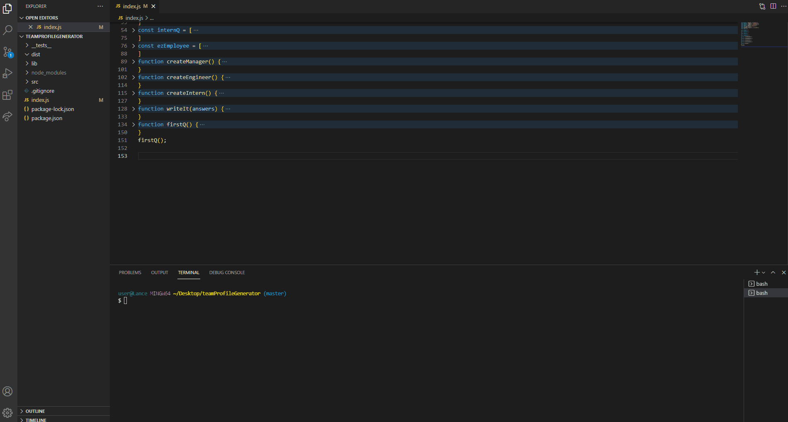

# Team Profile Generator

## Description

This is a node application designed to expedite the task of building a portfolio of team members (Managers, Engineers, Interns) relevant to any project or company.
    
## https://github.com/lancebailey26/teamProfileGenerator

## Installation

Clone the repository, install required packages via "npm install" in the command line (req: inquirer, jest)

## Testing
This application can be tested with the jest suite, by running "npm test" in the command line.

## Usage

Run "node index.js" in the command line and follow the prompts, then recieve your generated page in the "dist" folder.

## Credits

* Inquirer - https://www.npmjs.com/package/inquirer

## Copyright Lance Bailey 7/7/2021 License: MIT License